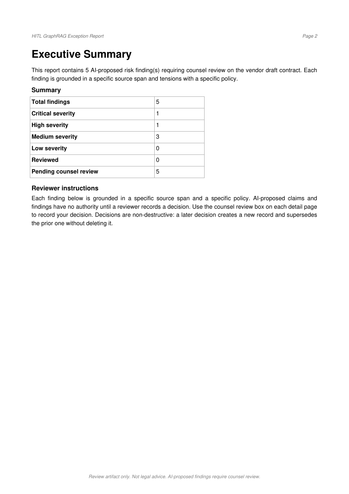
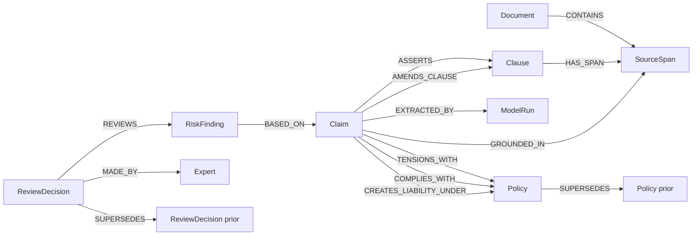

# Human-in-the-Loop GraphRAG Legal Reference Model

> AI proposes; counsel disposes.

A reference architecture for auditable semantic extraction, source-span-grounded claims, and non-destructive human review.

This repository is a compact reference model for preserving provenance, review authority, and model-independent curation history in high-stakes legal/compliance AI workflows.

It demonstrates a simple but important architectural separation:

- the contract text is **evidence**,
- the source span is **addressable evidence**,
- the AI claim is a **proposed interpretation**,
- the risk finding is a **reviewable issue**,
- the lawyer's decision is the **authority record**.

The project is intentionally not a chatbot, SaaS prototype, contract automation tool, or legal advice system. It is a reference architecture for an **epistemic control layer** around AI-assisted legal review.

This system does not "solve hallucinations." It contains hallucination risk by preventing AI output from becoming authoritative without human legal review.

---

## Why This Exists

Many enterprise AI demos treat generation as the final artifact. In legal and compliance workflows, generation is only a proposal. The durable artifact is the review record: what source text was considered, what interpretation was proposed, what policy it tensioned with, and what an authorized human decided.

This repository models that review record.

---

## Sample Output

The pipeline generates a lawyer-facing exception report for human review.

See: [`docs/assets/sample_exception_report.pdf`](docs/assets/sample_exception_report.pdf)



---

## What This Demonstrates

This architecture separates, by design, what most systems collapse:

- **source text** (the contract)
- **source span** (the addressable evidence)
- **clause** (the legally meaningful unit)
- **claim** (an AI-proposed interpretation)
- **risk finding** (a reviewable issue)
- **policy** (the baseline rule the finding tensions with, versioned)
- **model run** (which AI produced the claim)
- **review decision** (the human authority record, non-destructive)

In one sentence: the graph is an **epistemic control layer** between the contract and the exception report.

---

## Reference Model Invariants

The architecture enforces several design invariants:

1. A `Claim` must never exist without a `SourceSpan`.
2. A `Claim` must never exist without a `ModelRun`.
3. A `RiskFinding` must be based on at least one `Claim`.
4. A `RiskFinding` is not a legal decision.
5. A `ReviewDecision` must be a separate node.
6. A later `ReviewDecision` supersedes an earlier one; it does not overwrite it.
7. A `Policy` must be versioned.
8. A reportable finding must include enough provenance for counsel to review it without trusting the model.

These invariants are enforced by `src/evaluate.py` and codified in [`docs/graph_contract.md`](docs/graph_contract.md).

---

## Architecture

```text
Document -> SourceSpan -> Claim -> RiskFinding -> ReviewDecision
                       \-> Policy
                       \-> ModelRun
```

The full graph diagram is in [`docs/architecture.mmd`](./docs/architecture.mmd).



---

## Why Not Just RAG?

| Ordinary RAG | Epistemic Control Graph |
|---|---|
| retrieves passages | preserves addressable source spans |
| generates answers | proposes claims |
| logs prompts | records model runs |
| summarizes risk | creates reviewable findings |
| overwrites outputs | preserves decision history |
| user trusts answer | expert reviews claim |

A fuller discussion is in [`docs/why_not_just_rag.md`](./docs/why_not_just_rag.md).

For an explicit threat model — what kinds of model error this architecture is designed to contain — see [`docs/failure_modes.md`](./docs/failure_modes.md).

---

## Run Locally

```bash
cd /Projects/hitl-graphrag-legal-reference-model
cp .env.example .env
pip install -e .
python -m src.validate
python -m src.ingest
python -m src.review
python -m src.evaluate
python -m src.render_report
```

Optional Neo4j Docker for the ingest / review / evaluate steps:

```bash
docker run \
  --name neo4j-hitl-reference \
  -p7474:7474 -p7687:7687 \
  -d \
  -e NEO4J_AUTH=neo4j/password \
  neo4j:latest
```

Layer a second model run over the same source spans (demonstrates non-destructive accumulation across model upgrades):

```bash
python -m src.review \
  --findings sample-data/expected_findings_v2.json \
  --model-run sample-data/model_run_v2.json
```

Record a human review decision:

```bash
python -m src.curate \
  --finding-id FINDING-001 \
  --decision escalated \
  --expert-id EXPERT-001 \
  --rationale "Requires negotiation with vendor."
```

Run the tests:

```bash
make test
```

Run the whole demo end-to-end (requires Neo4j):

```bash
make demo
```

`render_report` does **not** require Neo4j; it regenerates the PDF directly from the sample-data files.

---

## What This Is Not

- Not a legal advice tool.
- Not a contract automation product.
- Not a production security model.
- Not a replacement for counsel.
- Not a benchmark against CUAD.
- Not an LLM performance evaluation.
- Not a web application.
- Not a chatbot.

---

## What This Demonstrates (Concretely)

- Source-span-grounded semantic extraction.
- Model-independent review history.
- Durable human curation.
- Policy tension tracking as first-class graph relationships.
- Policy versioning (one historical payment-terms policy is preserved and superseded).
- Multi-run audit (a second deterministic model run is provided to show non-destructive accumulation).
- Exception reporting for counsel.
- Audit-friendly AI workflow design.
- Separation of evidence, interpretation, finding, and decision.

---

## Sample Data

The sample data is **synthetic and CUAD-inspired**. It is hand-crafted to exercise the schema and demonstrate realistic policy tensions in a vendor contract negotiation, including:

- vendor narrows broad indemnity to mutual / finally-adjudicated indemnity,
- vendor caps indemnification, confidentiality, data-security, and IP infringement liabilities,
- vendor changes payment terms from Net-30 to Net-90,
- vendor designates "sole and exclusive" remedies,
- vendor's exclusive-remedy language conflicts with the company's equitable-remedies policy.

No third-party contract text is redistributed. No Enron or CUAD source documents are committed to this repository.

---

## Mapping to Public Legal Datasets

The conceptual model maps cleanly to CUAD-style legal datasets:

| CUAD concept | Reference model node |
|---|---|
| Contract document | `Document` |
| Answer span | `SourceSpan` |
| Clause category | `Clause` |
| Model extraction output | `Claim` |
| Policy mismatch / risk interpretation | `RiskFinding` |
| Lawyer annotation / review | `ReviewDecision` |

A future optional adapter under `examples/cuad_adapter/` could map CUAD annotations into the schema without committing third-party data. The mapping logic is the only thing that would live in this repository; the dataset itself would be fetched at runtime by the adapter.

---

## Repository Layout

```text
.
├── README.md
├── pyproject.toml
├── .env.example
├── Makefile
├── schema/                # JSON and human-readable schema, plus ontology
├── sample-data/           # synthetic baseline, policy, vendor draft, model runs, findings
├── src/                   # config, db, validate, ingest, review, curate, evaluate, render_report
├── reports/               # generated PDF lands here (gitignored)
├── docs/
│   ├── reference_model.md     # entities, lifecycle, invariants, maturity model
│   ├── graph_contract.md      # guarantees the curation graph upholds
│   ├── why_not_just_rag.md
│   ├── failure_modes.md       # the threat model
│   ├── architecture.mmd
│   ├── sample_exception_report_notes.md
│   └── assets/                # committed sample PDF and preview PNG
└── tests/                 # pytest suite
```

---

## License

MIT.
