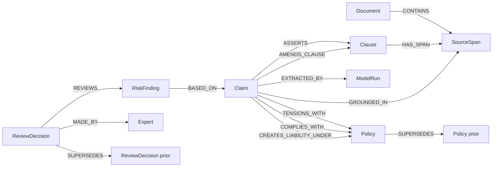

# Human-in-the-Loop GraphRAG Legal Reference Model

> AI proposes; counsel disposes.

This repository is a small reference model for **human-in-the-loop GraphRAG** in high-stakes legal and compliance workflows. It demonstrates how LLMs can propose semantic interpretations while a graph-based curation layer preserves source provenance, review history, and human authority.

This is **not** a demo app, a SaaS prototype, or a chatbot. It is a compact reference architecture showing how high-stakes AI systems can preserve source-grounded claims, provenance, human review authority, and model-independent curation history when LLMs are used for legal or compliance semantic extraction.

---

## The Problem with Ordinary RAG

Ordinary RAG systems built for legal review tend to:

- retrieve text and generate summaries that conflate source, interpretation, and conclusion,
- collapse the model's *proposal* and the lawyer's *decision* into a single answer,
- lose durable review history when answers are regenerated,
- make model upgrades hard to audit because the prior outputs disappear,
- treat AI-generated text as if it were a durable institutional artifact.

In high-stakes review, that is unacceptable. Counsel cannot be expected to take responsibility for an answer they cannot trace back to source text, a model version, and a prior reviewer's rationale.

This system does not "solve hallucinations." It **contains hallucination risk** by preventing AI output from becoming authoritative without human legal review.

---

## What This Demonstrates

This architecture separates, by design, what most systems collapse:

- **source text** (the contract)
- **source span** (the addressable evidence)
- **clause** (the legally meaningful unit)
- **claim** (an AI-proposed interpretation)
- **risk finding** (a reviewable issue)
- **policy** (the baseline rule the finding tensions with)
- **model run** (which AI produced the claim)
- **review decision** (the human authority record)

In one sentence: the graph is an **epistemic control layer** between the contract and the exception report.

---

## Architecture

```text
Document -> SourceSpan -> Claim -> RiskFinding -> ReviewDecision
                       \-> Policy
                       \-> ModelRun
```

The full graph diagram is in [`docs/architecture.mmd`](./docs/architecture.mmd).



---

## Why Not Just RAG?

| Ordinary RAG | Epistemic Control Graph |
|---|---|
| retrieves passages | preserves addressable source spans |
| generates answers | proposes claims |
| logs prompts | records model runs |
| summarizes risk | creates reviewable findings |
| overwrites outputs | preserves decision history |
| user trusts answer | expert reviews claim |

A fuller discussion is in [`docs/why_not_just_rag.md`](./docs/why_not_just_rag.md).

---

## Run Locally

```bash
cd /Projects/hitl-graphrag-legal-reference-model
cp .env.example .env
pip install -e .
python -m src.validate
python -m src.ingest
python -m src.review
python -m src.evaluate
python -m src.render_report
```

Optional Neo4j Docker for the ingest / review / evaluate steps:

```bash
docker run \
  --name neo4j-hitl-reference \
  -p7474:7474 -p7687:7687 \
  -d \
  -e NEO4J_AUTH=neo4j/password \
  neo4j:latest
```

To record a human review decision after `review`:

```bash
python -m src.curate \
  --finding-id FINDING-001 \
  --decision escalated \
  --expert-id EXPERT-001 \
  --rationale "Requires negotiation with vendor."
```

Run the tests:

```bash
make test
```

Run the whole demo end-to-end (requires Neo4j):

```bash
make demo
```

`render_report` does **not** require Neo4j; it can regenerate the PDF directly from the sample-data files.

---

## What This Is Not

- Not a legal advice tool.
- Not a contract automation product.
- Not a production security model.
- Not a replacement for counsel.
- Not a benchmark against CUAD.
- Not an LLM performance evaluation.
- Not a web application.
- Not a chatbot.

---

## What This Demonstrates

- Source-span-grounded semantic extraction.
- Model-independent review history.
- Durable human curation.
- Policy tension tracking as first-class graph relationships.
- Exception reporting for counsel.
- Audit-friendly AI workflow design.
- Separation of evidence, interpretation, finding, and decision.

---

## Sample Data

The sample data is **synthetic and CUAD-inspired**. It is hand-crafted to exercise the schema and demonstrate realistic policy tensions in a vendor contract negotiation, including:

- vendor narrows broad indemnity to mutual / finally-adjudicated indemnity,
- vendor caps indemnification, confidentiality, data-security, and IP infringement liabilities,
- vendor changes payment terms from Net-30 to Net-90,
- vendor designates "sole and exclusive" remedies.

No third-party contract text is redistributed. No Enron or CUAD source documents are committed to this repository.

---

## Mapping to Public Legal Datasets

The conceptual model maps cleanly to CUAD-style legal datasets:

| CUAD concept | Reference model node |
|---|---|
| Contract document | `Document` |
| Answer span | `SourceSpan` |
| Clause category | `Clause` |
| Model extraction output | `Claim` |
| Policy mismatch / risk interpretation | `RiskFinding` |
| Lawyer annotation / review | `ReviewDecision` |

A future optional adapter under `examples/cuad_adapter/` could map CUAD annotations into the schema without committing third-party data. The mapping logic is the only thing that would live in this repository; the dataset itself would be fetched at runtime by the adapter.

---

## Repository Layout

```text
.
├── README.md
├── pyproject.toml
├── .env.example
├── Makefile
├── schema/                # JSON and human-readable schema, plus ontology
├── sample-data/           # synthetic baseline, policy, vendor draft, model run, findings
├── src/                   # config, db, validate, ingest, review, curate, evaluate, render_report
├── reports/               # generated PDF lands here
├── docs/                  # reference model, "why not RAG", architecture diagram, report notes
└── tests/                 # pytest suite
```

---

## License

MIT.
